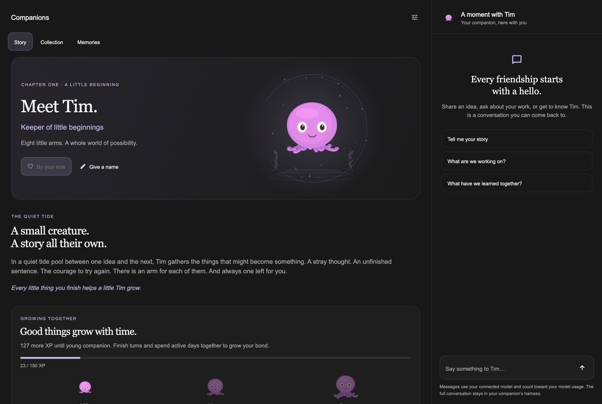

# The companion home

The owner requested a full DSH-style experience instead of an ASCII popup:
an illustrated, interactive viewer on the left and a conversation on the right.
This is the native viewer for the existing hidden `autonomous/pair` harness,
opened as one `companions` utility tab. It is not a second agent or a Store item.

The storybook treatment is a scoped exception to terminal workspace typography:
editorial serif titles, readable system-sans prose, softly tinted worlds, and
the established illustrated characters. Workspace chrome remains unchanged.
Colours follow the app palette. Large text and narrow windows stack the viewer
and expose Chat as a navigation choice. Character animation respects Reduce
Motion, the motion setting, background windows, and inactive tabs.

Top-bar click and the Daemon command open the home. Talk to daemon focuses its
composer. A ready first egg retains its direct hatch gesture. Settings opens
the existing guarded controls for consent, autonomy, notifications, and lesson
approval; those approval receipts and delays must not be bypassed by the viewer.

Story is authored fiction, explicitly separate from real-world history and the
individual's milestones. Growth comes from the roster's thresholds, not a
cosmetic timer. Collection cards select a viewing subject; only “Make my
companion” pairs it, through the existing zoo operation and device sync.
“Meet all ten” is a preview gallery and never unlocks or pairs anything.

The story's dial card can choose an owned companion on desktop and the addressed
device together. It uses `zoo.pair` and the existing `followCompanion` setting;
brightness and other device preferences are not overwritten. Sync status comes
from the device's acknowledgement, including the individual UID, growth stage,
seed, colour and markings. Offline, updating, and older firmware states remain
explicit. A collection preview cannot send an unowned companion to the dial.

Memories shows the actual hatch date, XP and approved shared lessons. Read and
forget use the existing local lesson interface. Forget is explicitly labelled as
affecting all agents and retains the learner's revision history. Pending lessons
still need the established person-only approval flow.

Opening the home never starts an engine. Sending chat starts or resumes the
existing pair DSH in ask mode. Each individual UID keeps its own workspace and
conversation; changing companions during a queued send refuses that send rather
than redirecting it. Up to 80 recent messages are kept locally per account and
UID for the viewer, while the complete engine conversation remains in the
companion harness. The full-conversation button opens that harness and its
permission prompts.

An engine still in first-run setup cannot receive injected chat text. The viewer
links to its full conversation for setup; an exited process with no conversation
starts fresh with the prompt passed at launch. No trust prompt is auto-accepted.

The pair's `say` tool carries an optional complete `reply` (8000 characters),
separate from the bounded status-bar `line`. Complete replies require the current
launch token and companion UID. They never carry action keys. Older harnessd
versions still supply their short replies. Chat uses the person's model usage.

Keep this behind the existing Experimental companion gate. A restored tab with
the experiment off does not load the collection or start chat.
The Focus-bar creature choice defaults to off and belongs to the signed-in
account, so enabling it on one computer also enables it on that account's other
computers. Other accounts retain their own choice. This opt-in is separate from
the server's optional account allowlist; the switch alone is not a private beta.
