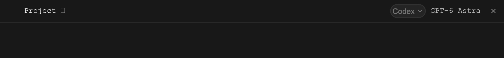

# Terminal workspace boundaries

The [desktop design system](desktop-design-system.md) governs all app UI around
the panes. It replaces this document's former fixed-cell and text-only rules
for welcome pages, forms, dialogs, pickers, menus, and buttons. Historical
screenshots show prior iterations and are not a presentation specification.

Use the [product terminology](../../docs/terminology.md): a tab groups harnesses;
a harness is one running agent session.

## Preserve the terminal

Terminal output, direct keyboard input, the in-pane composer, and in-pane find
remain terminal-native. Keep the selected terminal font, palette, exact content,
scrollback, selection, and input behavior. Real code, paths, and logs may use
monospace elsewhere when it helps readability.

Do not recreate, resize, or send input to a terminal merely because app chrome
opens or closes. Preserve terminal ownership, pending streams, viewer-owner
relationships, and pane state. Closing a pane removes its view immediately.

## Keep the workspace structure

Tabs remain compact and content-sized, adding one at a time until the row fills.
Preserve Command-number navigation and established working/question/done/failure
marks. Idle does not need a mark. Motion represents actual work and respects
Reduce Motion. Keep the top global actions compact and the Store button familiar.
Leave an 8-point control gap before Store. On macOS, notifications live in the
system menu bar; the window keeps Search and Store. Linux and browser bars
retain their notification bell. Show a count badge only when something is unread.
Tooltips explain icon actions and resolve shortcuts from the live keymap.

The footer shows a global harness count, local host CPU/RAM/GPU and subscription
allowance used on the left, all in neutral ink with whole percentages. Its
right-hand context follows the focused pane: machine, project, branch and PR.
Each terminal pane header ends with agent, model and close, in that order. The
close icon stays visible with quiet ink and no button chrome. Split and zoom
remain available through commands, menus and keyboard shortcuts. Splitting
opens New Harness with the focused pane's agent, machine and project. Clicking
the agent opens the shared `&` Agents picker; clicking the model opens Models;
the footer does not repeat model or effort. Agent switching saves the original
session before starting its replacement in the same project. Its pane and layout
survive peer cleanup of the stopped source. Agents that accept an initial message
receive bounded recent requests and saved answers, preserving the handoff across
retries; the saved original session keeps the full transcript. Do not show worktree implementation
paths in everyday labels. User-selected shell/Powerline status styles remain
available, including PR state colors and the option to disable color.

Machine opens its scope, Project opens related harnesses, Branch opens the
existing branches/PR history, and the PR opens its URL. These are navigation,
not checkout actions. Missing data stays honest. Dependent viewers use their
owner's context. See [workspace-status-bar.md](workspace-status-bar.md) for
behavior and data rules; the desktop design system controls presentation.

## Focused panes

The selected pane stays at full contrast. Other visible panes receive the
approved 30% neutral-gray veil; Graphite's inactive background is RGB 64,64,64.
A single or zoomed pane stays clear. Existing click and keyboard focus actions
own selection. Keep the current pane clear while a menu or the tab strip has
keyboard focus. Waiting-question borders remain visible above the veil.
The overlay does not consume the first click or alter terminal state.

Only the focused pane gets a location-colored rim: blue on this computer,
muted teal-gray (`AppPalette.remotePaneFocus`) on a known remote machine,
including a single or zoomed pane. Both use the same solid 1-point boundary.
Remote location is a quiet cue with less emphasis than local focus blue;
the footer identifies the machine in text. Unfocused panes keep their neutral
rim. The existing amber waiting-question border takes precedence over the
focus color. Location uses machine identity, independently of the connection's
transport mode.

## Input and review

Retain existing commands and their live remapping. Menus and visible controls
make those commands discoverable without requiring a shortcut lesson. Text
editors retain ordinary editing and composition. Disabled actions do not activate.

Review narrow windows, long names, terminal font changes, alternate terminal
palettes, dependent viewers, missing Git data, and light/dark app appearance.
Opening or dismissing desktop UI must return focus correctly and never type
into an agent accidentally. Use synthetic terminal content for saved previews.
