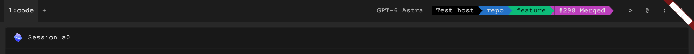
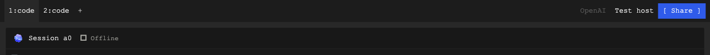
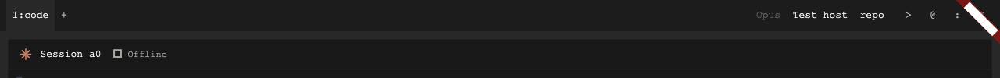
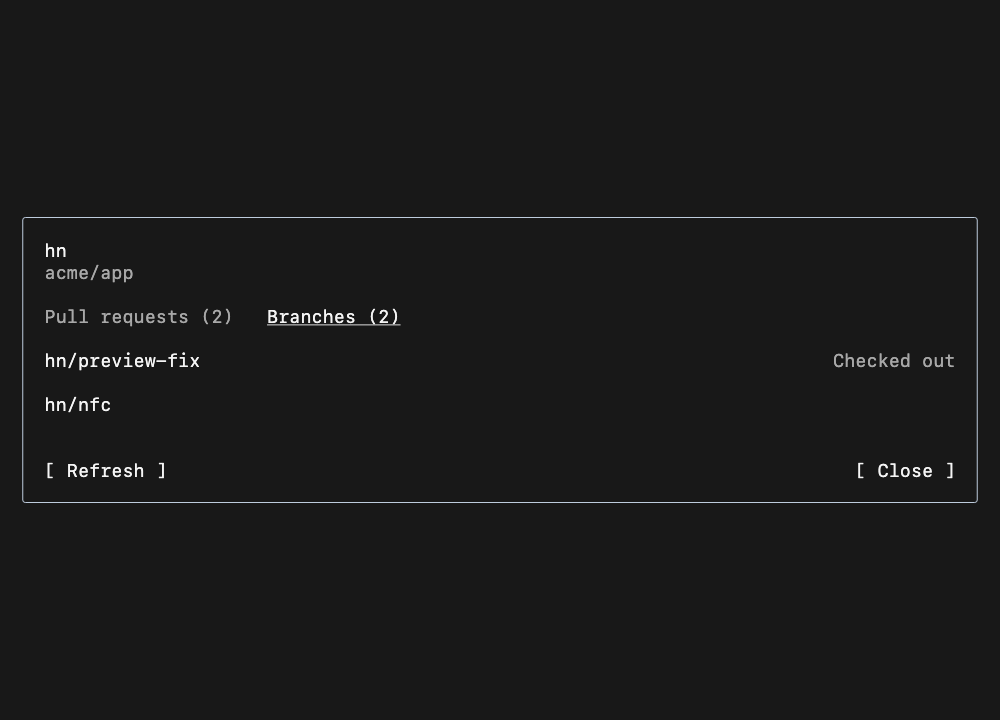
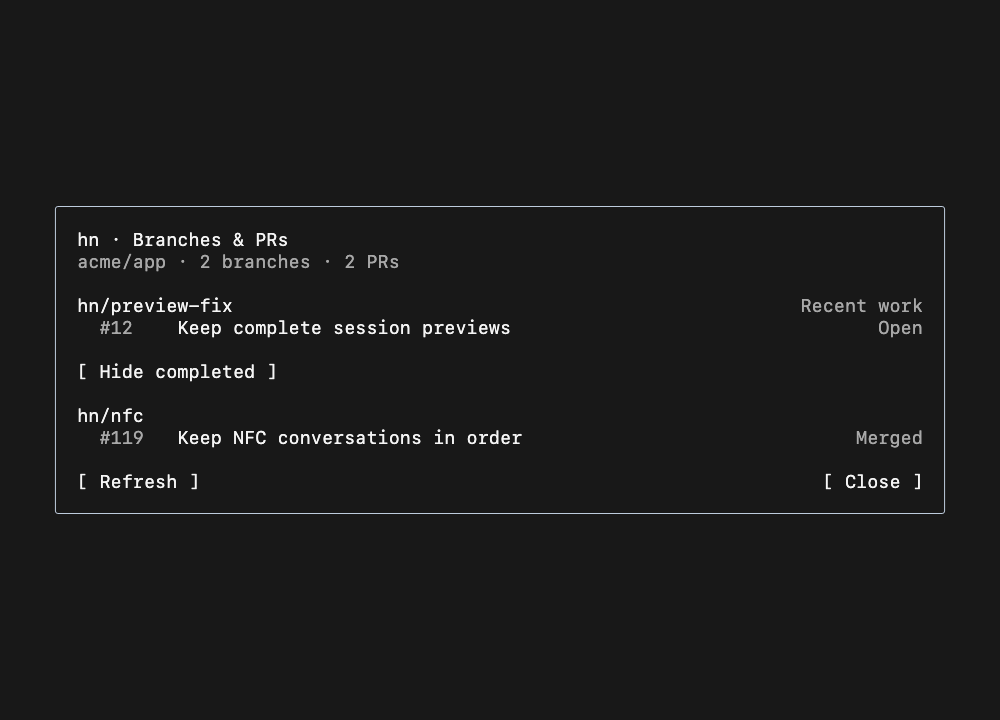
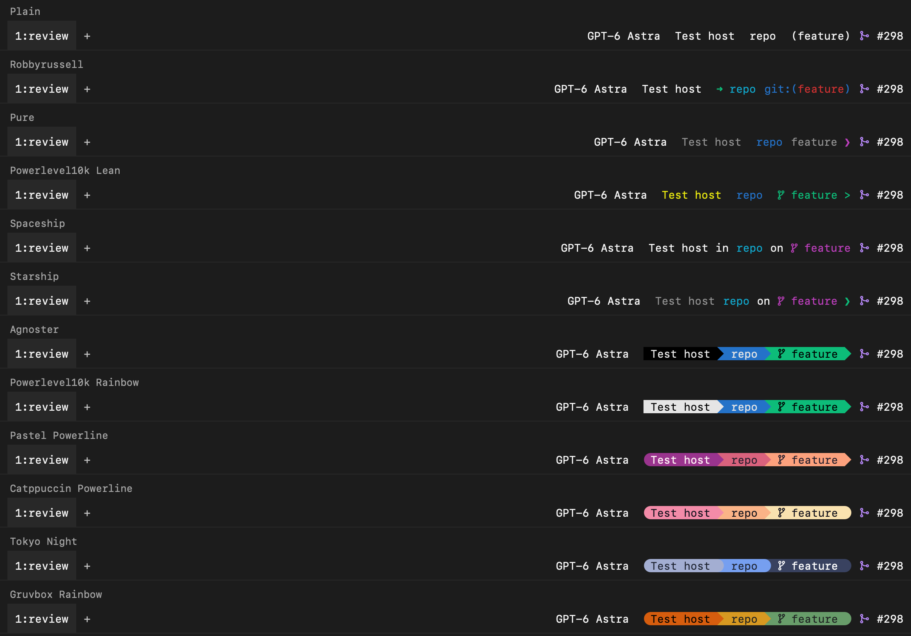

# Workspace status bar

One shared status line, using compact monospace text and measured character cells.
Follow the [terminal workspace design system](terminal-workspace.md).

```text
1:? api  2:⠹ web  3:✓ blender  +          M2  autonomous-harness  (main)   [ Share ]
```

## Tabs on the left

Each tab shows its number and a compact name. A user-entered name always wins:
once renamed, keep it across pane changes, closing/reopening, and saved layout
restores. Use automatic naming only when `nameIsCustom` is false. Custom-named
tabs do not vote in the automatic-name comparison. Count independent
harness panes once per agent; dependent viewers do not vote. Consider harness
type (`code`, `blender`, etc.), project name, and machine name. Choose the most
widely shared trait in that tab. Among equally shared traits, prefer the name
least repeated in other tabs; otherwise prefer type, then project, then machine.
Ties within one trait use pane order. Focus does not affect the name.

This keeps `blender` useful beside coding tabs, uses project names when all work
is code, and uses machine names for the same project on different computers.
Tabs with identical contents can still share a name; their numbers distinguish
them. Preserve the full name for inspection when its visible label is truncated.

Center the text with one cell of padding on each side. Cap long labels at 24
cells and scroll overflow, revealing the selected tab on keyboard navigation.
There is no close button or reserved close-button space. Cmd-W closes the active
tab; preserve remapped shortcuts, native menu access, and middle-click closing.
Preserve reorder, rename, keyboard focus, and terminal sessions. Cmd-T opens a
tab. Cmd-O opens the shared picker with `#` for projects; Cmd-P opens it directly
on harnesses. Cmd-Shift-P opens commands (`>`). The projects list has
no New Project/Open Folder row. Projects with an open pane in any tab come first;
each group is alphabetical. Pane focus and navigation history do not change that
order. Cmd-Q retains its native Quit action.

Tabs, status fields/symbols, PRs, and model labels and pane close actions share `WorkspaceBarControl`
in Flutter and the same native draw metrics: 28 pt minimum click height and
bold text on hover, press, and keyboard focus, with a hand cursor. Preserve the
underlying colors, including Agnoster segment backgrounds and joins. Reserve
both text weights during layout so labels and ribbon shapes never shift.
The active tab fills the entire bar height with the workspace background color,
joining the content below. Its resting text stays regular; do not add a `*`
marker. Keep text centered, with no ripple or rounded button well.



Do not show a tooltip that repeats a visible tab name (the numeric prefix does
not make it a different name). Show a different underlying name or the full
label when it is truncated. Keep action hints on symbols and status links.

The new-tab `+` uses a plain-text control: no resting
box, with bold text on hover or keyboard
focus. Keep its New Tab tooltip and shortcut hint.

### Harness activity

Use hn's one-character status vocabulary in two existing places: after the
number in a tab (`2:⠹ web`), and between the engine icon and title in a pane
header. Viewer headers show their owner's state. Shells, unknown agents, and
utility tabs have no harness activity mark. Keep the existing engine icon.
The mark replaces the native tab's old orange attention indicator; it adds no
new bar, counter, badge, or permanent legend. Hover and accessibility descriptions
explain each symbol.


| Mark | Meaning | Terminal color |
| --- | --- | --- |
| `?` | Needs your input | Yellow |
| `✗` | Last turn or launch failed | Red |
| `✓` | Finished and unread | Green |
| `⠋ ⠙ ⠹ ⠸ ⠼ ⠴ ⠦ ⠧ ⠇ ⠏` | Working, one frame per 100 ms | Cyan |
| `◌` | Starting | Yellow |
| `·` | Idle | Muted foreground |
| `‖` | Paused | Muted foreground |
| `○` | Offline | Muted foreground |

A tab shows its most urgent member in the order above, counting a harness and
its viewers once. For an individual harness, offline/paused/launch state takes
precedence; a current question takes precedence over working. A new turn masks
old results. Seeing a completion clears its unread check, but viewing a failed
turn does not clear the failure. A pane hidden by zoom or an inactive/utility
tab is not seen. Existing unread storage remains an in-memory, bounded list;
these marks are not a durable event history.

Reserve one measured cell for the mark and one for the gap. Animate only the
mark, never the label, width, terminal, or method-channel payload. Long tabs
shorten their names and scroll; preserve room for the number and mark. SF Mono
does not contain Braille, so Flutter explicitly falls back to the platform's
symbol font inside that fixed cell. Native text uses CoreText fallback.

Flutter shares one clock; AppKit has one local clock. Both derive the same frame
from Unix time. No visible working mark means no timer. Hidden panes and
offscreen tabs do not animate; background/inactive apps and Reduce Motion stop
the clock. Reduce Motion keeps the first Braille frame with its Working label.
Colors follow the terminal palette and the Color preference.

State rules live in `lib/state/harness_activity.dart`, with the Flutter mark in
`lib/widgets/harness_activity_mark.dart`. `harness_activity_test.dart`,
`workspace_activity_test.dart`, and the native titlebar checks cover state,
acknowledgement, fixed geometry, visibility, and animation. Set
`HARNESS_ACTIVITY_CAPTURE_DIR` when running the workspace activity test to
capture synthetic Flutter screenshots and the native tab payload.

Tab labels, status text, pane titles, and model selectors use **13 pt SF Mono,
regular weight at rest** on macOS. Linux uses its platform monospace stack at the same
size. Use `workspaceBarTextStyle()` and `workspaceBarCellSizeOf(context)` from
`lib/shared/theme/workspace_bar_style.dart`; the native bar receives that same
font through `barStyle`. Keep this size independent of terminal zoom and avoid
an additional UI text-scale factor. Selection uses background color, not bold.
Terminal content and dialogs still follow the user's selected terminal font
and size.


## Pane controls

The shared bar shows the focused harness's model selector before machine and
project. Pane headers keep the harness title and a hover-only ASCII `x` at their
far right. The `x` closes that pane view, keeps its harness running, and uses the
shared bold hover treatment. Its tooltip names Close Pane and the current shortcut.
Reserve its width so revealing it does not move the title.

For the model label, prefer
its local model ID or the daemon's observed subscription model (`selectedModel`),
such as `GPT-6 Astra`, `Fable`, or `Opus`. Keep versions when reported; never infer
a version from a family alias. Older daemons fall back to the provider name.
Keep this label visible without requiring hover, including while disconnected;
disable switching when the pane is read-only. Use a hand cursor, bold text on hover
and keyboard focus, and a tooltip explaining subscription/local switching.
Do not repeat the model name in that tooltip unless it is truncated or replaced
by `Switching…`. Preserve useful capability details and full truncated names
while offline, but do not advertise switching when it is disabled.
A model update must repaint the label without reopening or retargeting the pane.
The observed subscription model does not select a Local row in the picker.

Zoom and Stop remain keyboard/menu actions. Cmd-Shift-W closes the focused pane
view, Cmd-W closes the tab, and Cmd-Enter toggles pane zoom. Closing a view
keeps its harness running; Stop Harness remains a separate command with its
existing confirmation. Preserve explicit user keymap overrides.

Pane edges have no floating split buttons. Split Right and Split Down remain
keyboard commands (Cmd-R and Cmd-D by default), with File menu and command-search
access. Keep the resize gaps available for resizing.

Settings → Experimental → Share button is off by default on desktop and web.
The choice persists locally and updates the bar immediately; when off, no button
or space is reserved. [Settings reference](images/share-experimental.png).
When enabled, Share is a primary action at the far right
of the top bar, with a flat accent fill, white text, and the same fixed font and
control height as the other bar actions. Reserve its width before allocating tabs and context. Web
keeps Download app as a secondary text action immediately before Share.
Clicking Share or pressing Cmd-Shift-S (Alt-Shift-S on web) opens the existing
public/private link dialog for the focused agent. The tooltip and accessibility
label name that agent; the shortcut hint follows remaps. A dependent viewer
shares its owner. Empty tabs and view-only shared agents keep a disabled button.
Opening Share alone does not create a link or change access. Native macOS and
Flutter use the same command, labels, resolved colors, and availability.



Restart Harness and Share Harness also belong in File. Fork remains available in
command search. Viewer and message-composer toggles belong in View and command
search. These actions apply to the focused pane; sharing and viewer visibility
follow a dependent viewer's owner.

## Focused context on the right

Show the focused model, then `machine  project`, then `(branch)` when known.
The model is a separate plain text control so switching themes preserves its
click target. A focus change closes its picker; stale native actions and delayed
model selections cannot retarget a different harness.
Use the shared `AgentProject.label` rule: at a Git root, prefer the remote repo's
name, falling back to the local repo name; in a repo subfolder, use that folder's
name; outside Git, use the ordinary folder name. A worktree follows exactly the
same rule. Its generated path and `[worktree]` marker do not belong in the bar.
Keep the full actual path in the tooltip and accessibility detail.

A focused viewer shows its owning harness's context. Show only named branches;
omit detached commit hashes and absent project or Git metadata. Clear it for an
empty tab.



Each field is independently clickable, with the same bold hover/keyboard-focus
text and hand cursor as the status symbols. Machine opens the shared picker scoped by machine
identity; project opens its harnesses across matching remote checkouts; branch
opens the focused session's branches and PRs when the daemon supplies `gitContext`.
When recent successful work identifies one Git branch, show its name followed
by the count of other checked-out branches, for example `ship-hn +3`. The
tooltip explains that this is recent confirmed work and gives its observation
time. Git remains the source of branch names for every engine. When several
branches have equal recent evidence, show the count instead of selecting one.

Details use two plain tabs: **Pull requests** and **Branches**. The heading is
the session name and shared repository; do not append “Work” or “Recent work.”
Pull requests is the default, with one row per PR regardless of branch reuse.
Put the title on the left and the state on the right. Below it, show the PR number,
head/base branches and GitHub date. Use terminal green for Open, magenta for
Merged, red for Closed and muted text for Draft/Unknown. State text remains
readable without relying on color. Keep selection to the title line.

Open/draft PRs come first; merged and closed PRs stay visible in the same list.
Order them by actual GitHub update/merge/close time, never lookup time. The
Branches tab contains the branch inventory, with checked-out branches labeled.
Both lists retain their scroll positions. Left/Right on the tab controls switches
views. Narrow windows use the shorter “PRs” tab label and wrap the tabs without
shrinking text. Size the dialog to its contents with bounded scrolling. Escape
returns focus to the terminal.
Older daemons keep exact-branch project search, with Escape returning through its
scopes. Names never establish identity. Branch navigation does not check out or
create a branch. Unknown/multiple/unavailable work uses plain muted context text,
without a Git branch symbol when no single branch is displayed; the same action
remains inspectable.






Render these fixtures with `HARNESS_GIT_CONTEXT_CAPTURE_DIR=/tmp/work-dialog
flutter test test/session_work_dialog_test.dart`. Local macOS captures load the
system SF Mono face at 18 pt; the dialog itself follows the selected terminal
font, size and palette. The same suite checks narrow windows, enlarged text,
alternate palettes, and retained keyboard focus when appearance changes.

Customize Harness → Status offers twelve saved themes, grouped into Minimal
and Powerline, with a preview of the same sample pane beneath each choice.
Selection covers only the name row. Tab and Shift-Tab move between choices;
Enter or Space selects, scrolls the choice into view, and saves it. The selected
theme also previews PR status. Previews inherit the terminal font and cell size;
the workspace bar uses the fixed 13 pt bar font. Controls keep the plain terminal design.

| Theme | Treatment |
| --- | --- |
| Plain (default) | Monochrome `machine  project  (branch)`, including the PR |
| Robbyrussell | Green arrow, cyan project, blue `git:(` with red branch |
| Pure | Blue project, muted machine/branch, magenta prompt mark |
| Powerlevel10k Lean | Unboxed yellow machine, blue project, green branch symbol and ASCII `>` |
| Spaceship | Cyan project and magenta branch symbol, with `in` / `on` separators |
| Starship | Muted machine, cyan project, `on` and a magenta branch symbol, green prompt mark |
| Agnoster | Joined black context, blue project, and green branch segments |
| Powerlevel10k Rainbow | Light context, blue project, green branch, angular joins |
| Pastel Powerline | Plum, rose, and peach segments, rounded leading cap and angular joins |
| Catppuccin Powerline | Mocha red, peach, and yellow segments, rounded outside caps |
| Tokyo Night | Cool gray, blue, and indigo segments, rounded joins and outside caps |
| Gruvbox Rainbow | Warm orange, gold, and moss segments, rounded outside caps |



These are one-line visual adaptations, not installed shell themes or a ranking.
The catalog covers established Oh My Zsh themes plus Pure, Spaceship,
Powerlevel10k, and Starship's official presets. Starship is a separate prompt
engine that works with Zsh. Its named color presets are useful here because
they offer distinct palettes beyond changes to separators and spacing.

Powerline separators and branch symbols are drawn one-cell shapes and do not
require patched fonts. The branch symbol appears only with a real named branch;
it does not alter the branch's accessible name, tooltip, search, or click target.
At tight widths, segmented fields drop the decorative symbol and can fall back
to plain text. Prompt
marks and segment colors never invent dirty, ahead/behind, privilege, runtime,
clock, or exit-status readings. Plain retains familiar parenthesized branch
notation; Zsh's actual stock prompt is `%m%# ` (host and prompt character).

Minimal themes, Agnoster, and Powerlevel10k Rainbow use the terminal ANSI ramp.
Pastel Powerline, Catppuccin Powerline, Tokyo Night, and Gruvbox Rainbow carry
status-only palettes adapted from the linked Starship presets below. They do
not recolor terminal output or change the workspace palette. Keep these tokens
in the shared formatter, never duplicated in native code. Choose a readable
ink from the named palette (or black/white where necessary) so small text on
these filled segments has at least 4.5:1 contrast. Preserve the terminal font,
the existing bold-only hover cue, and stable field widths.

The rightmost PR label belongs to the focused harness, including when its viewer
has focus. Display `#298 Merged` (or Draft/Open/Closed), with a separate link
to that PR. Plain themes leave one text cell before the label. Segmented themes
connect it directly to the preceding arrow, making one continuous bar while
retaining the PR click target. The selected-theme preview
shows that same joined line. State colors come from the selected status palette:
muted for Draft, green for Open, magenta for Merged, and red for Closed. Turning
Color off applies a monochrome treatment to context and PR together. Plain always
uses the terminal foreground even when Color is enabled. Existing `standard`
settings resolve to Plain; existing `powerlevel10k` settings resolve to Lean.

References: [Oh My Zsh themes](https://github.com/ohmyzsh/ohmyzsh/wiki/Themes),
[Pure](https://github.com/sindresorhus/pure),
[Powerlevel10k Lean](https://github.com/romkatv/powerlevel10k/blob/master/config/p10k-lean-8colors.zsh),
[Powerlevel10k Rainbow](https://github.com/romkatv/powerlevel10k/blob/master/config/p10k-rainbow.zsh),
[Spaceship](https://github.com/spaceship-prompt/spaceship-prompt),
[Starship](https://starship.rs/),
[Pastel Powerline](https://starship.rs/presets/pastel-powerline),
[Catppuccin Powerline](https://starship.rs/presets/catppuccin-powerline),
[Tokyo Night](https://starship.rs/presets/tokyo-night), and
[Gruvbox Rainbow](https://starship.rs/presets/gruvbox-rainbow).
These are compact adaptations; machine/project/branch/PR remain real Harness data.

Read PR status through the owning machine's existing `git_pull_request` RPC.
Refresh once per minute while focused, reuse recent results across focus
switches, and discard stale replies after a pane, branch, or project change.
Unknown, absent, or inaccessible PRs have no label. Never display a previous
pane's PR while waiting for the newly focused one. Compact pane headers do not
also poll or display PR status.

References: [Zsh prompt parameters](https://zsh.sourceforge.io/Doc/Release/Parameters.html),
[Oh My Zsh themes](https://github.com/ohmyzsh/ohmyzsh/wiki/Themes),
[Robbyrussell source](https://github.com/ohmyzsh/ohmyzsh/blob/master/themes/robbyrussell.zsh-theme),
[Pure](https://github.com/sindresorhus/pure),
[Agnoster](https://github.com/agnoster/agnoster-zsh-theme), and
[Powerlevel10k](https://github.com/romkatv/powerlevel10k).

Pane headers keep task identity and the hover-only close action. The top bar
contains tabs, New Tab, focused model/machine/project/branch/PR context, and the
optional Share button.
Do not add a standalone Search label or category icons at the right edge.
Context links open the corresponding scope in the unified picker. Global
search remains available through Cmd-P and the app menu.

The picker's empty preview contains clickable `@ machines`, `# projects`,
`: models`, `* store`, and `> commands` hints. Each inserts its editable prefix
and returns typing focus to the search input. Machine and model management,
including API forms, stays inside the right pane. Store results open their
Store page. Cmd-O, Cmd-M, Cmd-I, and Cmd-Shift-P remain shortcuts into the same
picker; focused context links keep their scope.

Leave a window drag area between tabs and context and prevent overlap in
narrow windows. Native menus and commands remain available.

Only while daemons are on (the account's `GET /api/zoo` answered 200, or a
person enabled Settings → Experimental → Focus-bar creature), the daemon sits at the far right, directly
after the focused context and PR. Off, or before that is known, nothing is
reserved for it and the bar is exactly the one described above; when it turns
on, the slot waits for a quiet moment (no button held, the pointer off the
bar) so tabs never move under a click. On:
the paired daemon's sprite, or the nest while the first egg incubates
(`\_(  )_/` `\_(/\)_/` `\_(*')_/` `\_(oo)_/`). Its one-cell inner gutters provide
separation; add no extra gap or divider. Use the same 13 pt workspace font as
the status line with ligatures off, and reserve eight character cells plus
one-cell gutters, the sprite centred on its version's base sprite, so moods,
work frames and a nap's `z` never move nearby text. It draws in the status
line's own text colour, never its daemon colour (those fail contrast on a
status bar). A shiny daemon's `*` sits in the left gutter. Show only the egg
or creature in this fixed slot: no completed-turn count, egg count, or label
beside it. Additional eggs, progress, and activity details belong in the panel.
The slot keeps the same width while work finishes, eggs arrive, and the pointer
enters or leaves, so neither the creature nor its neighbors move.
Its name and progress belong in the tooltip and panel, never beside the
sprite. Clicking a ready egg hatches it; otherwise a click boops the daemon and
opens its panel. When something needs you or failed, its one line replaces the
context, PR and model in the terminal's yellow for 5.2 s, like tmux's message
line; a reply to a click is dim. Mood and frame updates repaint only the slot.
The contract is [daemons/README.md](../../daemons/README.md); the desktop's
choices are in [Daemons on the desktop](daemons.md).

Data rules live in `lib/state/workspace_status.dart`; prompt formatting lives in
`lib/shared/theme/status_line_style.dart`. Flutter draws the fallback bar in
`SwarmScreen`; macOS draws `SwarmTabStrip` in `macos/Runner/SwarmTitlebar.swift`.
Both use the same names, formatted context, resolved text/color segments, and
preferences. `WorkspacePullRequest` owns focused PR state; the native and Flutter
bars receive the same validated label and URL. Checks live in
`workspace_status_test.dart`, `workspace_pull_request_test.dart`,
`status_line_test.dart`, and `tool/swarm_titlebar_checks.swift`.

To regenerate the synthetic native catalog image, set
`HARNESS_NATIVE_STATUS_CAPTURE_DIR` to a temporary directory when running
`flutter test test/workspace_status_test.dart`. With the same variable, run
`bash tool/check_swarm_titlebar.sh /path/to/flutter --status-preview`;
`native-themes.png` is drawn by the production AppKit controls from the real
Dart payloads. No live window, account data, or saved appearance is used.
