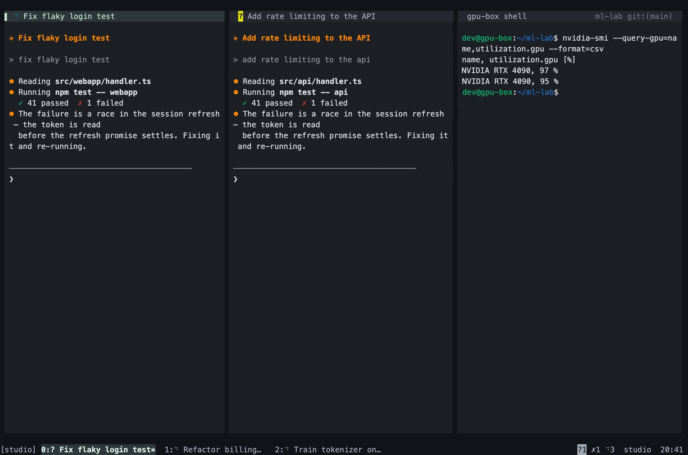
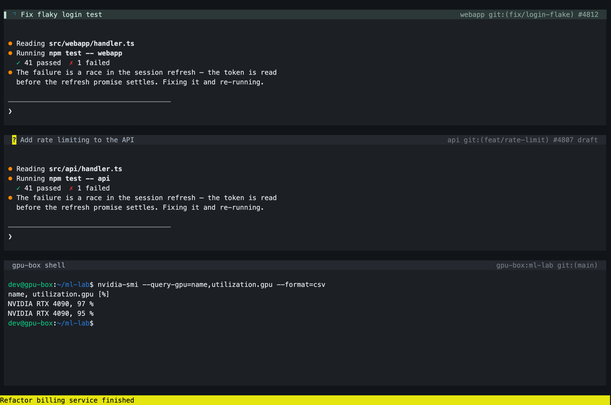

# hn pane surfaces

hn now presents terminal panes as quiet dark surfaces with space between them. Each pane has
an integrated title, an accent on the focused pane, and inset content. The status line stays
at the bottom with the same information in a calmer palette. Working and waiting indicators
remain visible. This changes the presentation while preserving tmux keys and split structure.





These images render ANSI cell captures from the real hn binary inside an isolated tmux PTY,
using mock harness output. They are terminal output, not design mockups. The rendering uses
Menlo and a representative ANSI palette; the user's terminal controls its own font and ANSI
colors.

## Geometry and compatibility

The layout tree remains responsible for named layouts, percentages, pane targeting, directional
navigation, resizing, and serialized `window_layout`. Presentation insets are calculated separately
and shared by rendering, cursor placement, PTY sizing, copy mode and application mouse input.
Position targets such as `top-left` and percentage splits use structural dimensions, so changing
the appearance cannot move the split boundaries. The original divider cells are blank gutters
and still support mouse dragging.

At normal sizes there is a one-cell gap around the pane surfaces and between adjacent panes,
one column of content padding on each side, and vertical padding where space permits. Small
panes automatically give these cells back to the program. A one-cell terminal remains responsive and survives resizing.
Program ANSI foregrounds, backgrounds and attributes remain intact; only default colors inherit
the pane surface palette. Explicit user styles and title formats still override the defaults.

The default is `set -g @hn-look panes`. `set -g @hn-look classic` selects the previous hn line
borders and green status line. `set -g @hn-look tmux` selects tmux's appearance and unpadded
content geometry. Switching applies immediately without recreating panes or changing the layout.

## Verification

The release build passes 135 Rust tests, including rectangle containment and usable minimum
sizes, adjacent surfaces, and preservation of user style overrides. The new `tui/tests/pane-ui.py`
exercises the running application with actual keys and SGR mouse input:

- Directional navigation and wrap, zoom/unzoom, copy selection, header focus and gutter dragging.
- All seven layouts and eight position targets with top, bottom and disabled pane titles.
- Identical split structure across appearances, including percentage splits on both axes.
- Application mouse coordinates after padding and after adding two status rows at the top.
- Explicit program foreground/background colors; 80x24, 24x8, 6x4 and 1x1 terminals.

The main e2e suite, layout synchronization suite, local shell lifecycle suite, native terminal
suite, and terminal attribute comparisons against real tmux also passed on macOS. The full
isolated real-stack suite passed all ten checks: real daemon, backend, MongoDB, Redis, tmux and
Chrome, including viewer input, browser reconnect, terminal lease recovery and C-b Space
persistence. OAuth and model execution are fixtures. No production account, live user pane,
installed hn binary or release was changed.

The new pane test is part of both Linux x86-64 and ARM64 CI jobs. To repeat it locally:

```sh
CARGO_TARGET_DIR=/tmp/hn-pane-target cargo test --manifest-path tui/Cargo.toml --release --offline
CARGO_TARGET_DIR=/tmp/hn-pane-target cargo build --manifest-path tui/Cargo.toml --release --offline
HN_PANE_UI_BINARY=/tmp/hn-pane-target/release/harness-tui \
  HN_PANE_UI_PORT=19783 python3 -u tui/tests/pane-ui.py
```

The test freezes the binary and uses a disposable home, explicit private hn/tmux sockets and
ports guarded to 19783–19789. Its processes are stopped before the test home is removed.
